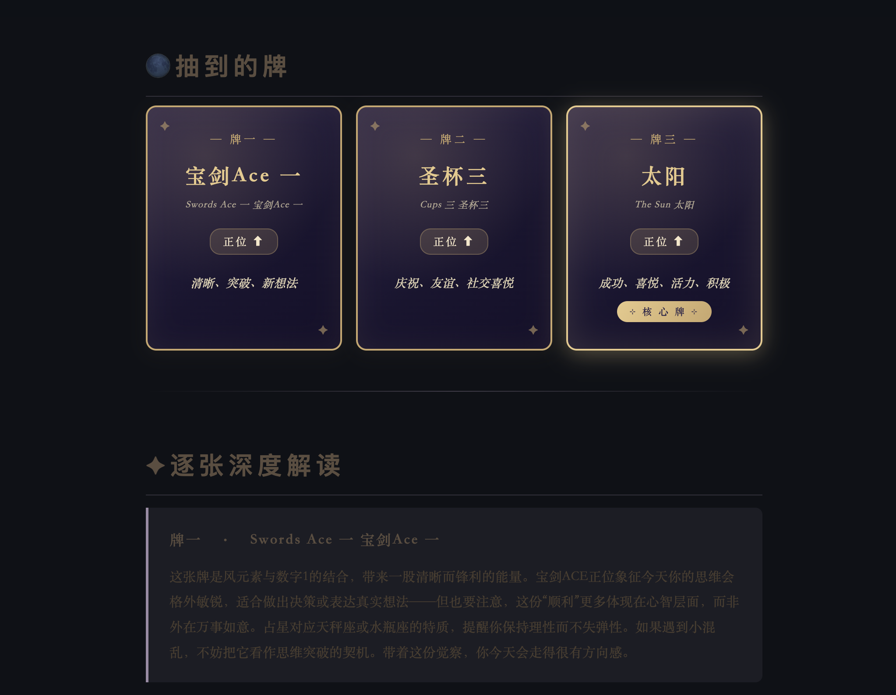

# ✦ 灵案 AstRa

> 一款融合**西方占星 · 塔罗 · 东方命理**的 AI 占卜助手

<p align="center">
  
</p>

🔗 **在线体验**：[lingan-astra.streamlit.app](https://lingan-astra.streamlit.app)

---

## ✨ 项目特色

灵案是一个**多源符号知识 RAG 系统**，融合塔罗、占星与命理三大体系，通过结构化知识库 + 多步链式 LLM 调用，让 AI 给出**有体系依据、有引用追溯**的占卜解读，而非泛泛而谈。

### 核心能力

- 🃏 **完整 78 张塔罗牌库**：大阿卡纳（占星对应）、小阿卡纳数字牌、宫廷牌全部结构化
- 🔥 **元素 + 灵数双重分析**：每次抽牌自动分析元素分布、灵数归元，识别核心牌
- 🧠 **多步链式 LLM 解读**：单卡深读 + 整体综合，避免一段大文字的阅读负担
- 🛡️ **Responsible AI 设计**：对体重身材、医疗、重大决策等敏感话题自动调整输出策略
- 📜 **占卜历史持久化**：JSON 本地存储，可复盘过往占卜
- 🎨 **莫兰迪 + 神秘卡牌视觉**：温柔的米色底配深色金边塔罗卡

---

## 🏗️ 技术架构
┌─────────────────────────────────────────────────┐
│         Streamlit Web App (app.py)              │
│   牌阵选择  ·  输入问题  ·  展示牌与解读             │
└────────────────────┬────────────────────────────┘
│
┌────────────────────▼────────────────────────────┐
│              tarot/ 核心模块                      │
│                                                  │
│   data_loader   ←  加载 JSON 知识库                │
│   drawer        ←  抽牌 + 完整核心牌规则            │
│   analyzer      ←  元素分布 + 灵数归元              │
│   interpreter   ←  多步链式 LLM 解读                │
│   history       ←  占卜历史持久化                   │
└────────────────────┬────────────────────────────┘
│
┌────────────────────▼────────────────────────────┐
│       knowledge_base/ 结构化知识库                │
│                                                  │
│   structured/major_arcana.json    22 张大牌      │
│   structured/minor_arcana.json    56 张小牌      │
│   structured/tarot_system.json    元素+灵数体系   │
│   structured/spreads.json         牌阵定义        │
│   canonical/*.md                  权威文档（RAG）  │
└─────────────────────────────────────────────────┘

---

## 🛠️ 技术栈

| 层 | 技术 |
|---|---|
| Web UI | Streamlit + 自定义 CSS |
| LLM | DeepSeek V3（中文 RAG 性价比最优） |
| 知识库 | 结构化 JSON + 权威文档（Waite 原典等） |
| 持久化 | JSON 本地存储 |
| 部署 | Streamlit Community Cloud |

---

## 🃏 牌阵规则（完整核心牌判定）

灵案支持三种牌阵，并实现完整的无牌阵核心牌规则：

| 场景 | 核心牌判定 |
|---|---|
| 单张牌阵 | 抽到的那张 |
| 三张时间线（过去/现在/未来）| 固定取中间位置 |
| 三张无牌阵·全小卡 | 取中间位置 |
| 三张无牌阵·1 张大卡 | 那张大卡 |
| 三张无牌阵·2 张大卡 | 取编号靠前者 |
| 三张无牌阵·3 张大卡 | 取中间编号者 |

---

## 🚀 本地运行

```bash
# 1. 克隆仓库
git clone https://github.com/ranweijia555-sys/Lingxi.git
cd Lingxi

# 2. 安装依赖
pip3 install -r requirements.txt

# 3. 配置 API Key
cp .env.example .env
# 编辑 .env，填入你的 DEEPSEEK_API_KEY

# 4. 运行
streamlit run app.py
```

浏览器自动打开 `http://localhost:8501`

---

## 📁 项目结构

Lingxi/
├── app.py                          # Streamlit 主入口
├── tarot_draw.py                   # 命令行入口
├── tarot/                          # 核心模块
│   ├── data_loader.py              # 数据加载
│   ├── drawer.py                   # 抽牌逻辑
│   ├── analyzer.py                 # 体系化分析
│   ├── interpreter.py              # AI 解读
│   ├── history.py                  # 历史记录
│   └── card_picker.py              # 手动选牌（拍照识别前置）
├── knowledge_base/
│   ├── structured/                 # 结构化数据
│   └── canonical/                  # 权威文档
├── build_tarot_json.py             # 大卡数据导出脚本
├── build_minor_arcana.py           # 小卡数据导出脚本
├── build_tarot_system.py           # 体系知识导出脚本
└── .streamlit/config.toml          # 主题配置

---

## 🗺️ 路线图

### ✅ 已完成
- [x] 完整 78 张塔罗牌结构化知识库
- [x] 元素 + 灵数双重分析引擎
- [x] 多步链式 LLM 解读
- [x] Responsible AI 守则
- [x] Streamlit Web App + 上线部署
- [x] 占卜历史本地持久化

### 🚧 进行中
- [ ] 拍照识别（多模态视觉）：用户拍下线下抽的牌，自动识别牌名 + 正逆位 + 牌阵布局
- [ ] 手动选牌界面：模糊搜索 + 分类菜单
- [ ] 中英双语 UI 切换

### 📅 计划中
- [ ] 西方占星模块（出生星盘 + 行星/宫位/相位解读）
- [ ] 东方八字命理（基础排盘 + 日主旺衰）
- [ ] 三体系交叉验证：同一问题同时给出塔罗/占星/八字视角
- [ ] Next.js 前端重写：扇形铺牌动画、3D 翻牌效果
- [ ] 真实塔罗牌图（Midjourney 生成统一风格）

---

## 🎨 设计理念

- **跨文化融合**：西方塔罗符号学、占星天文学 与 东方干支命理三大体系并置
- **可溯源**：每段解读基于结构化知识（元素、灵数、占星对应），而非黑盒生成
- **温柔有边界**：AI 永远不预测灾难、不做绝对判断、对敏感话题主动引导专业帮助

---

## 📜 License

MIT

---

<p align="center">⊹  灵案 AstRa  ·  当代命理 × AI  ⊹</p>
